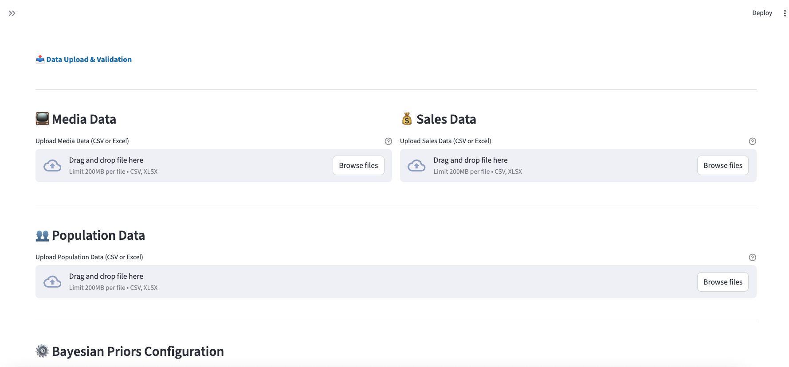
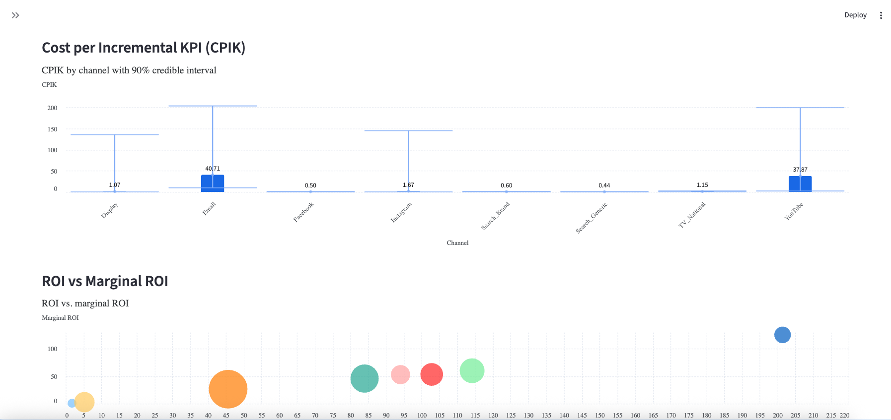

# Meridian MMM Platform

A comprehensive Marketing Mix Modeling (MMM) platform built on **Google's Meridian framework**, providing end-to-end capabilities for data ingestion, Bayesian modeling, budget optimization, and interactive visualization.

## 🎯 Project Overview

This platform implements a production-ready solution based on [Google Meridian](https://github.com/google/meridian) - an open-source MMM framework developed by Google that uses Bayesian hierarchical models to measure marketing effectiveness and optimize media spend allocation.

### What is Google Meridian?

Google Meridian is a state-of-the-art Marketing Mix Modeling solution that:

- **Uses Bayesian Statistics**: Incorporates prior knowledge and uncertainty into the model
- **Handles Geo-Level Data**: Works with geographic hierarchies (DMA, state, country)
- **Models Media Effects**: Captures adstock (lagged effects) and saturation (diminishing returns)
- **Enables Optimization**: Built-in budget optimizer for ROI maximization
- **Powered by JAX**: Fast computation with GPU support via Google's JAX framework

### Key Capabilities

This platform enables marketing analysts and data scientists to:
- **Ingest** multi-source marketing and sales data in standardized format
- **Model** marketing effectiveness using Meridian's Bayesian hierarchical models
- **Optimize** media budget allocation for maximum ROI
- **Visualize** results through interactive dashboards
- **Simulate** what-if scenarios for budget planning

## 🏗️ Architecture

```
meridian-mmm-platform/
├── src/meridian_platform/          # Core application code
│   ├── data_ingestion/             # Data loading and preprocessing
│   │   ├── media/                  # Media data ingestion
│   │   ├── sales/                  # Sales/KPI data ingestion
│   │   └── priors/                 # Bayesian priors configuration
│   ├── modeling/                   # Meridian model training
│   ├── optimization/               # Budget optimizer
│   ├── database/                   # PostgreSQL integration
│   └── utils/                      # Shared utilities
├── ui/                             # Streamlit user interface
├── notebooks/                      # Jupyter demos
├── data/                           # Data storage
├── tests/                          # Unit and integration tests
├── config/                         # Configuration files
└── docs/                           # Documentation
```

---

## 📸 Platform Screenshots

<div align="center">

### Data Ingestion & Model Training Interface

*Interactive Streamlit dashboard for uploading data, configuring models, and monitoring training progress*

### Model Results & Budget Optimization

*Visualization of channel effectiveness, ROI analysis, and optimized budget allocations*

</div>

---

## 🚀 Quick Start

### Prerequisites

- Python 3.11 or 3.12
- PostgreSQL 12+ (for production use)
- GPU recommended (T4 or better with 16GB+ RAM)
- CUDA toolkit (for GPU support)

### Installation

```bash
# Clone the repository
git clone <your-repo-url>
cd meridian-mmm-platform

# Create virtual environment
python3.11 -m venv venv
source venv/bin/activate  # On Windows: venv\Scripts\activate

# Install dependencies
pip install -r requirements.txt

# For GPU support (Linux only)
pip install -r requirements-gpu.txt

# Install the package in development mode
pip install -e .
```

### Database Setup (Optional)
## Database Setup

### Prerequisites

1. **Install PostgreSQL** (if not already installed):

```bash
   # For mac installation with homebrew
   brew install postgresql@14
   brew services start postgresql@14
   brew services list | grep postgresql
```

```bash
# Create PostgreSQL database
createdb meridian_mmm

# Run migrations (creates tables)
python scripts/init_database.py
```

### Running the Application

```bash
# Start Streamlit UI
streamlit run ui/streamlit_app/app.py

# Or run Jupyter notebooks
jupyter notebook notebooks/
```

## 📊 Data Format

### Understanding Meridian's Data Structure

Google Meridian requires data in a specific geo-temporal format that allows the model to capture geographic and temporal variations in media effectiveness. The framework expects:

1. **Time Series Data**: Weekly or daily observations
2. **Geographic Granularity**: DMA, state, or country level
3. **Media Touchpoints**: Individual marketing channels (TV, digital, radio, etc.)
4. **Outcome Variables**: Sales, revenue, or other KPIs

### Media Data Format

Your media data should follow this standardized format required by Meridian:

| Column | Type | Description | Required |
|--------|------|-------------|----------|
| `date` | datetime | Date of observation (YYYY-MM-DD) | ✅ |
| `geo` | string | Geographic identifier (DMA, state, country) | ✅ |
| `touchpoint_name` | string | Marketing tactic identifier | ✅ |
| `metric_value` | float | Media metric (GRPs, impressions, etc.) | ✅ |
| `spend` | float | Media spend in currency | ⚠️ |
| `mapping_id` | string | Granular identifier (campaign ID, etc.) | ❌ |

⚠️ = Optional but recommended, ❌ = Optional

**Example Media Data:**
```csv
date,geo,touchpoint_name,metric_value,spend
2024-01-01,US-NY,tv_national,1250.5,50000
2024-01-01,US-CA,digital_search,8500,12000
2024-01-01,US-TX,radio,450,8000
```

### Sales Data Format

| Column | Type | Description | Required |
|--------|------|-------------|----------|
| `date` | datetime | Date of observation | ✅ |
| `geo` | string | Geographic identifier | ✅ |
| `sales_value` | float | Sales in revenue units | ✅ |
| `sales_units` | float | Sales in unit count | ⚠️ |
| `sales_volume` | float | Sales in volume measure | ❌ |

**Example Sales Data:**
```csv
date,geo,sales_value,sales_units
2024-01-01,US-NY,125000,450
2024-01-01,US-CA,180000,620
2024-01-01,US-TX,95000,340
```

### Prior Configuration Format

Meridian uses Bayesian priors to incorporate domain knowledge. See `config/priors_template.yaml` for specifications including:

- **ROI Priors**: Expected return on investment per channel (e.g., TV: $2-$5 per dollar)
- **Saturation Curves**: Diminishing returns parameters (Hill coefficient)
- **Adstock Parameters**: Lagged media effects (carryover rates)
- **Coverage Factors**: Sell-in to sell-out adjustment ratios


## 🔬 Usage Examples

### How Meridian Models Work

The Meridian model uses a Bayesian hierarchical structure to estimate:

1. **Baseline Sales**: Sales that occur without marketing (organic demand)
2. **Media Contribution**: Incremental sales attributed to each channel
3. **Seasonality**: Time-based patterns in sales
4. **Geographic Effects**: Regional variations in response

The model accounts for:
- **Adstock Effects**: How media impact persists over time (e.g., TV awareness lasting weeks)
- **Saturation**: Diminishing returns as spend increases
- **Geographic Hierarchy**: Pooling information across similar markets

### 1. Data Ingestion

```python
from meridian_platform.data_ingestion.media import MediaDataLoader
from meridian_platform.data_ingestion.sales import SalesDataLoader

# Load media data
media_loader = MediaDataLoader(
    file_path="data/raw/media_data.csv",
    date_column="date",
    geo_column="geo"
)
media_data = media_loader.load_and_validate()

# Load sales data
sales_loader = SalesDataLoader(
    file_path="data/raw/sales_data.csv",
    date_column="date",
    geo_column="geo"
)
sales_data = sales_loader.load_and_validate()
```

<div align="center">

<br>
<em>The platform provides an intuitive interface for data validation and upload</em>
</div>

### 2. Model Training

```python
from meridian_platform.modeling import MeridianModelRunner

# Initialize model
runner = MeridianModelRunner(
    media_data=media_data,
    sales_data=sales_data,
    kpi_type='non_revenue',  # or 'revenue'
    use_gpu=True
)

# Train model
model, results = runner.train(
    n_warmup=1000,
    n_samples=1000,
    n_chains=2
)

# Generate diagnostics
diagnostics = runner.get_diagnostics()
```

### 3. Budget Optimization

```python
from meridian_platform.optimization import BudgetOptimizer

# Initialize optimizer
optimizer = BudgetOptimizer(model=model)

# Optimize for maximum ROI
optimal_allocation = optimizer.optimize_roi(
    total_budget=1_000_000,
    constraints='medium'  # 'small', 'medium', 'unconstrained'
)

# Optimize for same sales at minimum cost
min_cost_allocation = optimizer.optimize_efficiency(
    target_sales=current_sales,
    constraints='medium'
)
```

<div align="center">


<br>
<em>Budget optimization results showing recommended allocations and expected ROI by channel</em>
</div>

## 📈 Features

### Phase 1 (Current - ✅ Complete)
- [x] Standardized data ingestion for media and sales
- [x] Bayesian prior configuration
- [x] Meridian model integration
- [x] Basic budget optimization
- [x] Streamlit UI for data upload and modeling
- [x] Jupyter notebook demos
- [x] PostgreSQL integration
- [x] Comprehensive documentation

### Phase 2 (Planned)
- [ ] Advanced optimization constraints
- [ ] Model aggregation utilities
- [ ] Sell-in/sell-out adjustment factors
- [ ] A/B test integration (uplift models)
- [ ] Enhanced visualizations

### Phase 3 (Future)
- [ ] Multi-brand modeling
- [ ] Automated model refresh pipeline
- [ ] API endpoints for integration
- [ ] Advanced scenario planning tools

## 🧪 Testing

```bash
# Run all tests
pytest tests/

# Run with coverage
pytest --cov=src/meridian_platform tests/

# Run specific test suite
pytest tests/unit/test_data_ingestion.py
```

## 📚 Documentation

- **[Installation Guide](docs/installation.md)** - Detailed setup instructions
- **[Data Preparation](docs/data_preparation.md)** - How to prepare your data
- **[Model Configuration](docs/model_configuration.md)** - Configuring the Bayesian model
- **[Optimization Guide](docs/optimization.md)** - Budget optimization strategies
- **[API Reference](docs/api_reference.md)** - Code documentation
- **[Troubleshooting](docs/troubleshooting.md)** - Common issues and solutions

## 🔧 Configuration

Key configuration files:

- `config/database.yaml` - Database connection settings
- `config/model_defaults.yaml` - Default model hyperparameters
- `config/priors_template.yaml` - Bayesian prior templates
- `config/optimization.yaml` - Optimization constraints

## 🤝 Contributing

This is a solo data science project, but contributions are welcome:

1. Fork the repository
2. Create a feature branch
3. Make your changes with tests
4. Submit a pull request

## 📄 License

[Your License Here]

## 🙏 Acknowledgments

- **[Google Meridian](https://github.com/google/meridian)** - The core open-source MMM framework developed by Google's Marketing Analytics team
  - Based on research: "Bayesian Methods for Media Mix Modeling" 
  - Implements state-of-the-art geo-level MMM methodology
  - Powered by JAX for high-performance computing
- **Google Research** - For advancing MMM methodology and making it accessible
- **Anthropic** - For Claude's assistance in platform development

### About Google Meridian

Meridian is Google's contribution to making advanced Marketing Mix Modeling accessible to organizations of all sizes. The framework represents years of research in Bayesian statistics, causal inference, and marketing science. Key papers and resources:

- [Meridian Documentation](https://developers.google.com/meridian)
- [Meridian GitHub Repository](https://github.com/google/meridian)
- Google Research Blog: "Introducing Meridian: An Open-Source Marketing Mix Modeling Framework"

## 📞 Support

For issues and questions:
- Check the [Troubleshooting Guide](docs/troubleshooting.md)
- Review [Google Meridian Documentation](https://developers.google.com/meridian)
- Open an issue in this repository

## 🔄 Version History

### v0.1.0 (Phase 1 - Current)
- Initial release with core functionality
- Data ingestion pipelines
- Meridian model integration
- Basic optimization
- Streamlit UI

---

**Note**: This platform is built on **Google's Meridian framework** - an open-source, state-of-the-art Marketing Mix Modeling solution. Meridian uses Bayesian hierarchical models implemented in JAX to provide robust estimates of marketing effectiveness across channels and geographies.

For the underlying methodology, statistical foundations, and theoretical framework, refer to:
- [Official Meridian Documentation](https://developers.google.com/meridian/docs/basics/meridian-introduction)
- [Meridian GitHub Repository](https://github.com/google/meridian)
- [Google Research: MMM Best Practices](https://research.google/pubs/pub51998/)

